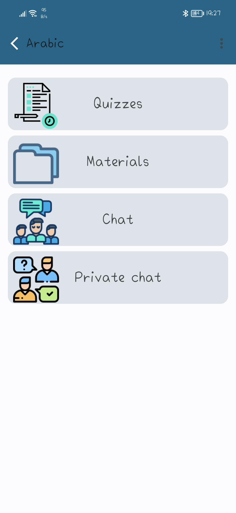

# Smart Learning
* Communication between the teacher and his students is considered a big problem in his daily life, After work time teacher can’t communicate with them or upload his lectures, so we built smart learning android application to facilitate communication. In this application, there are two types of users who can register teachers and students.

* Teacher users can add a course and quizzes, upload materials and lectures that help the students to understand the course and enable the teacher to test his students and their understanding.

* Student users can enroll in courses, solve the quizzes, download course materials and chat with their teacher and other students.

## Screenshots

  
  
  
  
  
  

## Downloads
